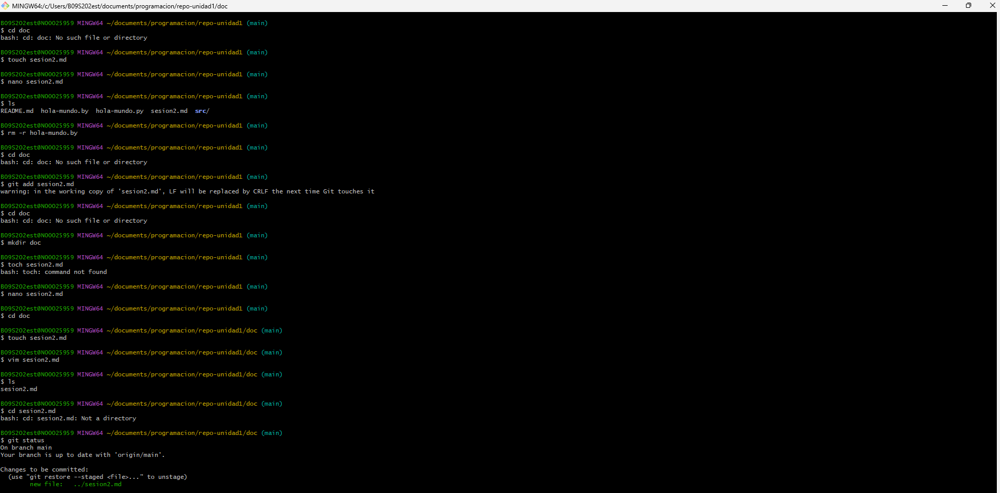

# como crear un repositorio nuevo en github
# como se enlaza con el repo local
# como se sincronizan

vamos a la Web de GitHub donde iniciamos sesion y de alli creamos un repositorio, elegimos nombr, personalizamos y luego conectamos a traves de un enlace, un codigo con la carpeta 

 

